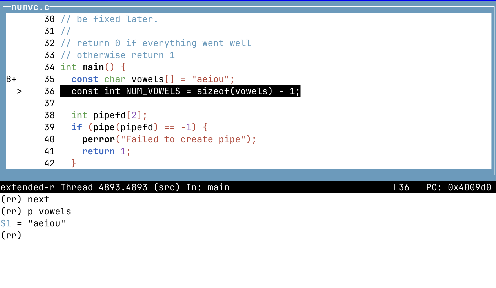

_23 May 2025_

### [Other writings](README.md)

# Record/Replay in a VM on macOS: A tutorial

I've modified the awesome [`rr`
debugger](https://github.com/rr-debugger/rr.git) so that it can run
without needing access to CPU Hardware Performance counters.

I call this variant, _Software Counters_ mode `rr` or `rr.soft`
for short. `rr.soft` supports aarch64 Linux (recent kernels)
in addition to x86_64 Linux. To learn more about `rr.soft`
see [previous blog post](009-rr-everywhere.md) or the github
[repo](https://github.com/sidkshatriya/rr.soft).

One compelling use case is running record/replay on **Linux VMs
on Apple silicon macOS**.  This is _not possible_ using [upstream
`rr`](https://github.com/rr-debugger/rr.git) because that needs HW
performance counters. Since `rr.soft` uses lightweight instrumentation,
access to CPU performance counters is not necessary.

**The topic of this blog post is to teach you how to record/replay
and debug a program using `rr.soft` through a small example program
written in C**.

Along the way we'll learn some advanced aspects of `rr` in general and
`rr.soft` specifically. This tutorial can be run on any platform where
`rr` / `rr.soft` works. But it would be interesting to try this tutorial
in a Linux VM on Apple silicon macOS.

Some familiarity with Posix/Linux API is useful, but not compulsory, to
understand the tutorial.  If you want to dig deeper on what a particular
function does, simply type in e.g. `man fork(2)`, `man pipe(2)`
etc. at your shell prompt.

_Caveats_: `rr.soft` is still relatively new and I'm sure there are some
bugs and rough edges -- please be aware of that if something does not
work as expected for you.

_Notation_: I mostly use the term `rr` generically. It would rapidly
become annoying to keep having to type "`rr` / `rr.soft`" everywhere in
this blog post. You should be able to tell easily from context 
if something is specific to upstream `rr` or just to `rr.soft` or related
to both.

## Installing `rr.soft` on Linux

You first need to be running in Linux.

On Apple Silicon (aarch64) macOS, you can get Linux running in a VM in various ways:
- Via UTM (See https://github.com/utmapp/UTM)
- Via [brew](https://brew.sh) (`brew install qemu`)
- Via [podman](https://podman.io) (`brew install podman` followed by `podman machine init`)

No doubt there are other approaches. Please consult the internet for an approach that
works for you.

Once you're logged into a Linux shell, goto https://github.com/sidkshatriya/rr.soft/wiki
to learn how to build and install _Software Counters_ mode `rr`.

## Tutorial

Here is a program called `numvc` ("Number of vowels and Characters") that
we're going to be using as a running example for the rest of this blog post.

This program does 2 things:
- Count the number of vowels appearing in stdin
- Count the number of *characters* (not bytes) appearing in stdin
  (e.g. ä is 1 character but takes 2 bytes)

For illustration purposes the character count is done behind the scenes
using the linux utility `wc` (This is somewhat inefficient but a good way
to show off some of the features of `rr` record/replay)

The program also has a small intentional bug (for teaching purposes) which
will be fixed later.

Here are is an example of running `numvc`:
```bash
$ echo abc | ./numvc
4
Number of vowels: 1
```

The output means that there are 4 characters and 1 vowel.

Yes 'a' is the only vowel but 4 characters ?? Ah, `echo` adds a return
by default. Lets remove that by using `echo -n`:
```bash
$ echo -n abc | ./numvc
3
Number of vowels: 1
```

This makes more sense. There are 3 characters in `abc` and 1 vowel.

Try to take some time to understand the program source code below.

You don't need to understand every single line of code though. See
you on the other side of the code !
```C
/**
 * Count the number of vowels and characters from stdin
 * (c) Sidharth Kshatriya 2025
 * MIT LICENSE
 */

#include <stdio.h>
#include <sys/wait.h>
#include <unistd.h>

int wait_for_wc();

/**
 * NOTE:
 *   This simple program is designed for teaching purposes.
 *   It may have flaws and lack best practices.
 *   Don't expect it to be production worthy !
 */

// This program does 2 things:
// - Count the number of vowels appearing in stdin
// - Count the number of *characters* (not bytes) appearing in stdin
//   (e.g. ä is 1 character but takes 2 bytes)
//
// For illustration purposes the character count is done using the linux utility
// `wc` (This is somewhat inefficient but a good way to show off some of the
// features of rr record/replay)
//
// The program also has a small intentional bug for teaching purposes which will
// be fixed later.
//
// return 0 if everything went well
// otherwise return 1
int main() {
  const char vowels[] = "aeiou";
  const int NUM_VOWELS = sizeof(vowels) - 1;

  int pipefd[2];
  if (pipe(pipefd) == -1) {
    perror("Failed to create pipe");
    return 1;
  }

  pid_t pid = fork();
  if (pid == -1) {
    perror("Failed to fork");
    return 1;
  } else if (pid == 0) { /* CHILD PROCESS */
    // Close the write end of the pipe
    close(pipefd[1]);

    if (-1 == dup2(pipefd[0], STDIN_FILENO)) {
      perror("Failed to make read pipe become the stdin");
      return 1;
    }

    // `wc` will handle UTF-8 characters correctly
    // If no file is specified, `wc` reads from stdin
    execlp("wc", "wc", "--chars", NULL);
    perror("Failed to exec `wc`");
    return 1;
  } else { /* PARENT PROCESS */

    // Close the read end of the pipe
    close(pipefd[0]);

    int c = 0;
    size_t vowels_count = 0;
    while ((c = fgetc(stdin)) != EOF) {
      for (int i = 0; i < NUM_VOWELS; i++) {
        if ((char)c == vowels[i]) {
          vowels_count++;
          break;
        }
      }
      // Write the byte to the pipe so it gets read by the `wc` child process
      ssize_t n = write(pipefd[1], &c, 1);
      if (n != 1) {
        perror("Failed to write to pipe");
        close(pipefd[1]);
        wait_for_wc();
        return 1;
      }
    }
    if (ferror(stdin)) {
      perror("Error reading from stdin");
      close(pipefd[1]);
      wait_for_wc();
      return 1;
    }
    close(pipefd[1]);
    int ret = wait_for_wc();
    if (ret) {
      return 1;
    }
    printf("Number of vowels: %lu\n", vowels_count);
  }
}

// Waits for the child process `wc` to exit
//
// If the child process `wc` exited with a zero exit status, function returns 0.
// Otherwise returns 1
int wait_for_wc() {
  int wstatus = 0;
  if (wait(&wstatus) == -1) {
    perror("Failed to wait for child process `wc`");
    return 1;
  }
  if (WIFEXITED(wstatus) && WEXITSTATUS(wstatus) == 0) {
    return 0;
  }
  return 1;
}
```

## How to compile `numvc`

Compile the program:
```bash
$ gcc -g -O0 -o numvc numvc.c
```

Compiler flags and why we use them:
- `-g` flag means to compile with debug information. If you plan to
  unleash `gdb` on the program, this flag is necessary otherwise the
  debugging experience will be very subpar
- `-O0` means to compile without any optimizations. When debugging
  in any debugger like `gdb`, if the program is compiled with
  optimizations, certain variables may be "optimized away" and you
  will not be able to print them. Also the debugger may not be able
  to stop exactly at the breakpoints you set. So we compile _without_
  optimizations

Let's use some fancy characters with diacritics and invoke `numvc` again:
```bash
echo -n cät | ./numvc
3
Number of vowels: 0
```

Yes, there are three characters in `cät`. The counting program does
not get confused by `ä` (even though it is represented in UTF-8 as 2
bytes). Also number of vowels as 0 is fine because we don't define
`ä` as a vowel.

Let's try a more complicated example:
```bash
echo -n 'lol CAT!' | ./numvc
8
Number of vowels: 1
```

8 characters in `lol CAT!` is correct. What ? 1 vowel ?! 'A' is also
a vowel and the result should be 2 here. Something is wrong. Let's
investigate.

# Simple record/replay

Let's first record the program:
```bash
$ rr record -W -- bash -c "echo -n 'lol CAT!' | ./numvc"
```

The `-W` flag means we want to use software counters. This is necessary
because `rr` does not have access to CPU HW performance counters for our particular
scenario (record/replay on a Linux VM on Apple Silicon macOS).

Note that the `-W` flag will only work if you've built _Software Counters_ mode
`rr` aka [`rr.soft`](https://github.com/sidkshatriya/rr.soft). The upstream `rr`
executable does not recognize this flag.

This is what the output should look like:
```bash
rr: Saving execution to trace directory `/home/sidk/.local/share/rr/bash-25'.
8
Number of vowels: 1
```

Wow ! we've captured this in a recording referred to as `bash-25`.
We can keep recording all kinds of programs after this but the above name
`bash-25` is the unique one to refer to the above recording in the future.

You may also wonder why we wrapped the command in `bash -c`. This is
because we want to make sure that `rr` captures all the programs involved
in the recording.  Sometimes piping can be tricky to record and adding
a `bash -c` wrapper just ensures the whole pipeline is captured rather
your shell thinking we want to piping something _from_ `rr`.

Let's replay `bash-25` as see if it was exactly how we recorded it:
```bash
# -W means use software counters mode
# -a means you want to replay the whole recording without involving the gdb debugger
$ rr replay -W -a bash-25
8
Number of vowels: 1
```

Yup, it is exactly the same.

# Seeing all the programs recorded via `rr ps`

One powerful feature of `rr` is that you can see all the programs that
are present in the recording. This is always useful for debugging and
understanding the recording:
```bash
$ rr ps bash-25
PID     PPID    EXIT    CMD
4709    --      0       bash -c echo -n 'lol CAT!' | ./numvc
4892    4709    0       (forked without exec)
4893    4709    0       ./numvc
4924    4893    0       wc --chars
```

You can see that `numvc` invokes `wc`. The PPID (Parent Process ID) of
`wc` is `4893` which is the PID of `numvc`.

This is a great feature of `rr` in itself. Often when you have a program
invoke another program it can be a very useful debugging
aid to do the recording and seeing the `rr ps` output. Here
you can see that `wc` was invoked with `--chars` flag.

It can become quickly tiresome to keep typing in `bash-25`. If `bash-25`
was the most recent recording you made, you can use `rr ps` or any other `rr`
sub-command like `rr replay` without explicitly mentioning the recording
name `bash-25`.

# Let's see `rr ps` for a simple `gcc` compilation

To show the power of `rr ps` let's just record the compilation of `numvc`
itself:
```bash
$ rr record -W -- gcc -O0 -g -o numvc numvc.c
rr: Saving execution to trace directory `/home/sidk/.local/share/rr/gcc-0'.
```

Now let's see what processes exist in the recording:
```bash
$ rr ps gcc-0
PID     PPID    EXIT    CMD
12889   --      0       gcc -O0 -g -o numvc numvc.c
13072   12889   0       /usr/libexec/gcc/aarch64-redhat-linux/15/cc1 -quiet numvc.c -quiet -dumpbase num
vc.c -dumpbase-ext .c -mlittle-endian -mabi=lp64 -g -O0 -o /tmp/ccEgb2nJ.s
13253   12889   0       as --gdwarf-5 -EL -mabi=lp64 -o /tmp/cc5mJ660.o /tmp/ccEgb2nJ.s
13374   12889   0       /usr/libexec/gcc/aarch64-redhat-linux/15/collect2 -plugin /usr/libexec/gcc/aarch
64-redhat-linux/15/liblto_plugin.so -plugin-opt=/usr/libexec/gcc/aarch64-redhat-linux/15/lto-wrapper -pl
ugin-opt=-fresolution=/tmp/ccDMXbQr.res -plugin-opt=-pass-through=-lgcc -plugin-opt=-pass-through=-lgcc_
s -plugin-opt=-pass-through=-lc -plugin-opt=-pass-through=-lgcc -plugin-opt=-pass-through=-lgcc_s --buil
d-id --no-add-needed --eh-frame-hdr --hash-style=gnu -dynamic-linker /lib/ld-linux-aarch64.so.1 -X -EL -
maarch64linux -o numvc /usr/lib/gcc/aarch64-redhat-linux/15/../../../../lib64/crt1.o /usr/lib/gcc/aarch6
4-redhat-linux/15/../../../../lib64/crti.o /usr/lib/gcc/aarch64-redhat-linux/15/crtbegin.o -L/usr/lib/gc
c/aarch64-redhat-linux/15 -L/usr/lib/gcc/aarch64-redhat-linux/15/../../../../lib64 -L/lib/../lib64 -L/us
r/lib/../lib64 -L/usr/lib/gcc/aarch64-redhat-linux/15/../../.. -L/lib -L/usr/lib /tmp/cc5mJ660.o -lgcc -
-push-state --as-needed -lgcc_s --pop-state -lc -lgcc --push-state --as-needed -lgcc_s --pop-state /usr/
lib/gcc/aarch64-redhat-linux/15/crtend.o /usr/lib/gcc/aarch64-redhat-linux/15/../../../../lib64/crtn.o
13405   13374   0       /usr/bin/ld -plugin /usr/libexec/gcc/aarch64-redhat-linux/15/liblto_plugin.so -p
lugin-opt=/usr/libexec/gcc/aarch64-redhat-linux/15/lto-wrapper -plugin-opt=-fresolution=/tmp/ccDMXbQr.re
s -plugin-opt=-pass-through=-lgcc -plugin-opt=-pass-through=-lgcc_s -plugin-opt=-pass-through=-lc -plugi
n-opt=-pass-through=-lgcc -plugin-opt=-pass-through=-lgcc_s --build-id --no-add-needed --eh-frame-hdr --
hash-style=gnu -dynamic-linker /lib/ld-linux-aarch64.so.1 -X -EL -maarch64linux -o numvc /usr/lib/gcc/aa
rch64-redhat-linux/15/../../../../lib64/crt1.o /usr/lib/gcc/aarch64-redhat-linux/15/../../../../lib64/cr
ti.o /usr/lib/gcc/aarch64-redhat-linux/15/crtbegin.o -L/usr/lib/gcc/aarch64-redhat-linux/15 -L/usr/lib/g
cc/aarch64-redhat-linux/15/../../../../lib64 -L/lib/../lib64 -L/usr/lib/../lib64 -L/usr/lib/gcc/aarch64-
redhat-linux/15/../../.. -L/lib -L/usr/lib /tmp/cc5mJ660.o -lgcc --push-state --as-needed -lgcc_s --pop-
state -lc -lgcc --push-state --as-needed -lgcc_s --pop-state /usr/lib/gcc/aarch64-redhat-linux/15/crtend
.o /usr/lib/gcc/aarch64-redhat-linux/15/../../../../lib64/crtn.o
$
```

You're certainly not expected to understand the above output. But it's
easy to appreaciate that a simple `gcc` compilation involves multiple
programs behind the scenes.

You have:
- The main `gcc` driver program, `gcc`, having PID 12889
- Other `gcc` helper programs like `cc1` and `collect2`
- The assembler program `as` having PID 13072
- The linker program `/usr/bin/ld` having PID 13405

With this little detour done, lets get back to exploring `numvc`.

# Let's explore the `numvc` program in the `bash-25` recording

The PID of `numvc` is `4893`. Let's debug with `rr` using `rr replay`:
```bash
$ rr replay -W -p 4893 bash-25
```

- `-W` means you want to use software counters. This is necessary because
  `rr` does _not_ have access to hardware counters for our particular scenario
  (Linux VM on Apple Silicon macOS).
- `-p 4893` means that we want to start up `gdb` as soon as the `numvc` process
  execv-es.

You should see something similar to this:
```bash
$ rr replay -W -p 4893 bash-25
GNU gdb (Fedora Linux) 16.3-1.fc42
Copyright (C) 2024 Free Software Foundation, Inc.
License GPLv3+: GNU GPL version 3 or later <http://gnu.org/licenses/gpl.html>
This is free software: you are free to change and redistribute it.
There is NO WARRANTY, to the extent permitted by law.
Type "show copying" and "show warranty" for details.
This GDB was configured as "aarch64-redhat-linux-gnu".
Type "show configuration" for configuration details.
For bug reporting instructions, please see:
<https://www.gnu.org/software/gdb/bugs/>.
Find the GDB manual and other documentation resources online at:
    <http://www.gnu.org/software/gdb/documentation/>.

For help, type "help".
Type "apropos word" to search for commands related to "word"...
Reading symbols from /home/sidk/.local/share/rr/bash-25/mmap_clone_79_numvc...
Remote debugging using 127.0.0.1:8256

--------------------------------------------------
 ---> Reached target process 4893 at event 474.
--------------------------------------------------
Reading symbols from /lib/ld-linux-aarch64.so.1...
warning: BFD: warning: system-supplied DSO at 0x6ffd0000 has a section extending past end of file
warning: Discarding section .replay.text which has an invalid size (54) [in module system-supplied DSO at 0
x6ffd0000]
_start () at ../sysdeps/aarch64/dl-start.S:23
23      ENTRY (_start)
```

When you repeat the above `gdb` may ask you the following question:
```bash
This GDB supports auto-downloading debuginfo from the following URLs:
  <https://debuginfod.fedoraproject.org/>
Enable debuginfod for this session? (y or [n])
```

You should ideally answer `y` here and press enter. This is not seen
in the transcript above because I've added `set debuginfod enabled on`
to my `~/.config/gdb/gdbinit` file. See the note on `debuginfod` below.

Anyways, lets inspect the output above. This all looks complicated but is
not. `gdb` is just telling us that we're at the entry point of the `numvc`
program. Entry points are usually named `_start` in Linux. `main()` is
still a glimmer in the mind's eye and far away. Let's set a breakpoint on
`main` and run to it:
```bash
(rr) b main
Breakpoint 1 at 0x4009b4: file numvc.c, line 35.
(rr) c
Continuing.

Breakpoint 1, main () at numvc.c:35
35        const char vowels[] = "aeiou";
```

We've reached main !

It would be fun to explore the `fork()` glibc library call.
Let's now set a breakpoint and run to it:
```bash
(rr) b fork
Breakpoint 2 at 0xffff80c3d660: file fork.c, line 41.
(rr) c
Continuing.

Breakpoint 2, __libc_fork () at fork.c:41
41      {
(rr) list
36            _IO_lock_init (*((_IO_lock_t *) _IO_iter_file(i)->_lock));
37      }
38
39      pid_t
40      __libc_fork (void)
41      {
42        /* Determine if we are running multiple threads.  We skip some fork
43           handlers in the single-thread case, to make fork safer to use in
44           signal handlers.  Although POSIX has dropped async-signal-safe
45           requirement for fork (Austin Group tracker issue #62) this is
```

It's all a bit complicated. Let's explore fork source code later. Let's
do something special that `rr` allows us to do: set a `checkpoint`
! We can come back to this checkpoint later !

```bash
(rr) checkpoint
Checkpoint 1 at   __libc_fork () at fork.c:41
```

Let's try to find our way back to our own source `numvc.c` by using `reverse-step`:
```bash
(rr) reverse-step
main () at numvc.c:44
44        pid_t pid = fork();
```

Yay ! we were able to reverse step back into our `numvc.c` program. Let's delete
the breakpoint on `fork` as we don't need it anymore:
```bash
(rr) info b
Num     Type           Disp Enb Address            What
1       breakpoint     keep y   0x00000000004009b4 in main at numvc.c:35
        breakpoint already hit 1 time
2       breakpoint     keep y   0x0000ffff80c3d660 in __libc_fork at fork.c:41
        breakpoint already hit 1 time
(rr) del 2
```

Let's continue our exploration of `numvc` program:
```bash
(rr) next
45        if (pid == -1) {
(rr) next
48        } else if (pid == 0) { /* CHILD PROCESS */
(rr) next
65          close(pipefd[0]);
(rr) next
67          int c = 0;
(rr) next
68          size_t vowels_count = 0;
(rr) next
69          while ((c = fgetc(stdin)) != EOF) {
(rr) next
70            for (int i = 0; i < NUM_VOWELS; i++) {
```

BTW if you were doing all this debugging yourself I would strongly
recommend using the in-built `gdb` TUI i.e. Text User Interface. In
`gdb` simply type `tui enable` or `tui disable` when done. In this blog
I'm NOT using the TUI so you can follow along more easily.

In case you're curious, the `gdb` TUI looks like this:



Now, what is the _first_ character in our stdin input stream ?
```
(rr) p/c c
$1 = 108 'l'
```

Reassuringly it is indeed `l` (as part of the input `lol CAT!`).

Let's explore the `fork` library function. By restarting at checkpoint 1
that we made earlier:
```bash
(rr) restart 1
70            for (int i = 0; i < NUM_VOWELS; i++) {
warning: Discarding section .replay.text which has an invalid size (54) [in module system-supplied DSO at 0
x6ffd0000]

Program stopped.
__libc_fork () at fork.c:41
41      {
```

Wow we're back at our checkpoint in `fork` ! (more technically
`__libc_fork` which another name for the same function).

Let's see a few lines of code of this function:
```bash
(rr) list
36            _IO_lock_init (*((_IO_lock_t *) _IO_iter_file(i)->_lock));
37      }
38
39      pid_t
40      __libc_fork (void)
41      {
42        /* Determine if we are running multiple threads.  We skip some fork
43           handlers in the single-thread case, to make fork safer to use in
44           signal handlers.  Although POSIX has dropped async-signal-safe
45           requirement for fork (Austin Group tracker issue #62) this is
```

Let's just explore this function a bit more by doing `next`:
```bash
(rr) next
48        bool multiple_threads = !SINGLE_THREAD_P;
(rr) next
51        lastrun = __run_prefork_handlers (multiple_threads);
(rr) next
60        if (multiple_threads)
(rr) next
75        pid_t pid = _Fork ();
(rr) next
77        if (pid == 0)
```

_Oops!_ I wanted to explore `_Fork` !! That function seemed promising but
now we've missed it. Time to restart the whole debugging session !?!

Nope! Don't worry, in `rr` we can always go back in time.
Since our last command was `next` we can use `reverse-next`:
```bash
(rr) reverse-next
75        pid_t pid = _Fork ();
```

And... we're back in business ! Let's `step` into `_Fork()`:
```bash
(rr) step
__GI__Fork () at ../sysdeps/nptl/_Fork.c:31
31        __abort_lock_rdlock (&original_sigmask);
```

Note that `gdb` is calling it `__GI__Fork` which is the glibc internal
name for the function. This happens a lot with `glibc` but is otherwise
harmless and just something to keep in mind.

Let's see a bit of the source code for `_Fork`:
```bash
(rr) list
26      {
27        /* Block all signals to avoid revealing the inconsistent TCB state
28           to a signal handler after fork.  The abort lock should AS-safe
29           to avoid deadlock if _Fork is called from a signal handler.  */
30        internal_sigset_t original_sigmask;
31        __abort_lock_rdlock (&original_sigmask);
32
33        pid_t pid = arch_fork (&THREAD_SELF->tid);
34        if (pid == 0)
35          {
```

`arch_fork` looks interesting. Let's run to it and disassemble it:
```bash
(rr) b arch_fork
Breakpoint 3 at 0xffff80c38cf4: file ../sysdeps/unix/sysv/linux/arch-fork.h, line 43.
(rr) c
Continuing.

Breakpoint 3, arch_fork (ctid=0xffff80d9c0f0) at ../sysdeps/unix/sysv/linux/arch-fork.h:43
43        ret = INLINE_SYSCALL_CALL (clone, flags, 0, NULL, 0, ctid);

(rr) disassemble
Dump of assembler code for function __GI__Fork:
   0x0000ffff80c38cc0 <+0>:     paciasp
   0x0000ffff80c38cc4 <+4>:     sub     sp, sp, #0x30
   0x0000ffff80c38cc8 <+8>:     adrp    x0, 0xffff80d2f000 <_nl_C_locobj+192>
   0x0000ffff80c38ccc <+12>:    ldr     x0, [x0, #3712]
   0x0000ffff80c38cd0 <+16>:    stp     x29, x30, [sp, #16]
   0x0000ffff80c38cd4 <+20>:    add     x29, sp, #0x10
   0x0000ffff80c38cd8 <+24>:    stp     x19, x20, [sp, #32]
   0x0000ffff80c38cdc <+28>:    ldr     x1, [x0]
   0x0000ffff80c38ce0 <+32>:    str     x1, [sp, #8]
   0x0000ffff80c38ce4 <+36>:    mov     x1, #0x0                        // #0
   0x0000ffff80c38ce8 <+40>:    mov     x0, sp
   0x0000ffff80c38cec <+44>:    bl      0xffff80bacac4 <__abort_lock_rdlock>
   0x0000ffff80c38cf0 <+48>:    mrs     x5, tpidr_el0
=> 0x0000ffff80c38cf4 <+52>:    mov     x0, #0x11                       // #17
   0x0000ffff80c38cf8 <+56>:    sub     x4, x5, #0x650
   0x0000ffff80c38cfc <+60>:    movk    x0, #0x120, lsl #16
   0x0000ffff80c38d00 <+64>:    mov     x1, #0x0                        // #0
   0x0000ffff80c38d04 <+68>:    mov     x2, #0x0                        // #0
   0x0000ffff80c38d08 <+72>:    mov     x3, #0x0                        // #0
   0x0000ffff80c38d0c <+76>:    mov     x8, #0xdc                       // #220
   0x0000ffff80c38d10 <+80>:    svc     #0x0 // <=========== SYSCALL MADE HERE
... (omitted for brevity) ...
```

Look at the last assembly instruction in the disassembly above.

`svc #0x0` is the `syscall` assembly instruction on aarch64.  The syscall
number is stored in the `x8` register. The syscall number for `clone`
is 0xdc or 220 in decimal. The `clone` syscall is a complex syscall in
Linux and, among other things, is used to do the traditional Linux `fork()`.

Wrapping this sub-section up... We've basically seen a normal
`gdb` like debugging session except that in `rr` you can use `reverse-step` and
`reverse-next` to step backwards in time or set checkpoints in the code
and then `restart` to a particular checkpoint.

As you can see `rr` is very useful to learn the innards of programs and
the libraries those programs depend on e.g. glibc. If you ever `step` or `next`
by mistake you're never a `reverse-step` or `reverse-next` away.

We didn't make much of a headway into solving the bug in the `numvc` but
the purpose of this post is really to get you familiar with `rr`. Solving
the bug will come soon.

### `debuginfod` interlude

In the above `gdb` transcript you may have noticed that we stepped into the
`fork` glibc function and we saw C source code and not assembly !

The is because `gdb` can automatically download debuginfo/source code
from the Linux distro `debuginfod` server (Here I'm using Fedora).

If your distribution does _not_ support `debuginfod`, or you don't
_want_ to use `debuginfod`, you might need to install the debuginfo and
debug source packages for the glibc package manually e.g.  `sudo dnf
install glibc-debuginfo glibc-common-debuginfo glibc-debugsource` which
is tedious to do because you often need to find out which packages are
required and then install those package.  Just use `debuginfod` if you
can, it will save you a lot of trouble.

The main benefit of `debuginfod` is that it allows you to drill down
into the source code any any of the library/external program dependencies
of the program you're debugging _very easily_.

Note that `rr.soft` itself does NOT need debuginfo to peform
record/replay.  Only if you want to drill down into the source code of
your program/library you're debugging with `gdb` do you need debuginfo
(whether obtained via `debuginfod` or via the installation of relevant
packages through your distro package manager or whether embedded in the
executable itself).

# Let's fix the bug: Why does `lol CAT!` have only 1 vowel?

A reminder: There is a bug in the `numvc` program -- it doesn't count
the number of vowels properly.

Let's start to `gdb` debug when process `4893` (the `numvc` process)
makes its first appearance (after execve) as we did before:
```bash
$ rr replay -W -p 4893 bash-25
GNU gdb (Fedora Linux) 16.3-1.fc42

... (omitted for brevity) ...

_start () at ../sysdeps/aarch64/dl-start.S:23
23      ENTRY (_start)
```

Let's place a breakpoint at the `main` function and run to it like before:
```bash
(rr) b main
Breakpoint 1 at 0x4009b4: file numvc.c, line 35.
(rr) c
Continuing.

Breakpoint 1, main () at numvc.c:35
35        const char vowels[] = "aeiou";
```

Now let's place a breakpoint at the `printf` that prints the number of vowels
and run to it.
```bash
(rr) b 96
Breakpoint 2 at 0x400bb4: file numvc.c, line 96.
```

As a reminder, this is what line 96 looks like, with some context:
```C
  92│    int ret = wait_for_wc();
  93│    if (ret) {
  94│      return 1;
  95│    }
  96│    printf(format: "Number of vowels: %lu\n", vowels_count); // <--- ADD BREAKPOINT HERE
  97│  }
```

Now lets run to line 96 and print out the number of vowels seen so far:
```bash
(rr) c
Continuing.
8

Breakpoint 2, main () at numvc.c:96
96          printf("Number of vowels: %lu\n", vowels_count);
(rr) p vowels_count
$1 = 1
```

Dissappointingly, the number of vowels is 1 when it should be 2.
('lol CAT!' has 2 vowels: 'o' and 'A').

Let's put a breakpoint at line 73 which is the `break` statement:
```bash
(rr) b 73
Breakpoint 3 at 0x400ad8: file numvc.c, line 73.
```

As an easy reckoner this what like line 73 looks like with some context:
```C
  69│    while ((c = fgetc(stream: stdin)) != EOF) {
  70│      for (int i = 0; i < NUM_VOWELS; i++) {
  71│        if ((char)c == vowels[i]) {
  72│          vowels_count++;
  73│          break; // <----------- ADD BREAKPOINT HERE
  74│        }
  75│      }
  76│      // Write the byte to the pipe so it gets read by the `wc` child process
```

The `break` happens only when a vowel has been found.

Now for the magic of reverse debugging. Let's `reverse-continue`,
i.e. move backwards in program execution until the `break` statement is
reached. **This will take us to the last successful find of a vowel in
the program**:
```bash
(rr) reverse-continue
Continuing.

Breakpoint 3, main () at numvc.c:73
73                break;
(rr) p vowels_count
$2 = 1
(rr) p/c c
$3 = 111 'o'
```

**What is interesting is the last vowel found was 'o' !** (`p/c` means
print character).

If our program had been correct, `p/c c` would have printed `A`.

Hmm... in line 35 we have:
```C
  35│        const char vowels[] = "aeiou";
```

The bug lies in this line. The correct code should be:
```C
const char vowels[] = "aeiouAEIOU"
```

That's the fix! You can try changing the program and now seeing if
you get the correct number of vowels now for 'lol CAT!'.

_Mission Accomplished_ as far as the bug goes. But let's explore a bit
more about `rr`'s features now that we're here.

# Let's dig into the `wc` program a bit

We're going to use another secret weapon of `rr` in which we can see
the event number of all outputs to stdout/stderr. The event numbers
allow us to go to a particular moment of execution of any program
in the recording easily:

```bash
$ rr replay -W -M -a bash-25
[rr 4924 943]8
[rr 4893 962]Number of vowels: 1
```

Every Linux system call entry/exit (and some other important events)
are assigned a unique, monotonically increasing event number by `rr`. It
is unique for the whole recording regardless of which process the event
took place in. The `-M` flag shows the event number for the `write`
to stdout/stderr Linux system call.

Let's investigate write event `943` after which message "8" was written
to stdout. It comes from process `4924` which corresponds to the `wc`
child process. Note that the next line `Number of vowels: 1` comes from
process `4893` which corresponds to the parent process which is `numvc`.

We need to simply start the replay with flag `-g 943` which basically
means goto event number `943`:
```bash
$ rr replay -W -M -g 943 bash-25
[rr 4924 943]GNU gdb (Fedora Linux) 16.3-1.fc42
... (Omitted for brevity) ...
--------------------------------------------------
 ---> Reached target process 4924 at event 944.
--------------------------------------------------
... (Omitted for brevity) ...
Reading symbols from /home/sidk/.local/share/rr/bash-25/mmap_clone_124_wc...
Downloading 185.52 K separate debug info for /home/sidk/.local/share/rr/bash-25/mmap_clone_124_wc
Reading symbols from /home/sidk/.cache/debuginfod_client/7beb45d8e969a5581f32452a0d9b49d048bf5f8d/debuginfo
...
Downloading 462.91 K separate debug info for /home/sidk/.cache/debuginfod_client/7beb45d8e969a5581f32452a0d
9b49d048bf5f8d/debuginfo
Remote debugging using 127.0.0.1:9517
... (Omitted for brevity) ...
```

The above output is actually brilliant. Note how `gdb` seamlessly
downloads the debugging information for `wc` via `debuginfod`. See
this line:
```bash
Downloading 185.52 K separate debug info for /home/sidk/.local/share/rr/bash-25/mmap_clone_124_wc
````

Now we asked to go to event `943` but the text in `gdb` says "Reached
target process 4924 at event 944".  Don't worry about this "off-by-one"
event -- `rr` has placed us into `gdb` at the right execution point. How
do we know this ? Observe the first line of the output carefully:
```bash
[rr 4924 943]GNU gdb (Fedora Linux) 16.3-1.fc42
```

Since we started replay with `-M` flag, we see that `rr` has reached
event 943.  `rr` printed `[rr 4924 943]` but then `gdb` took over the
stdout and started printing its own stuff.

Anyways, as soon as the `gdb` prompt `(rr)` appears let's type `stepi`:
```bash
0x0000000070000004 in syscall_traced ()
(rr) stepi
8
```

The `stepi` will step over the `svc #0x0` instruction we should be on and
trigger the `write` system call. And voila we see "8" printed to stdout
(see above).

BTW don't be confused: `(rr)` is indeed the `gdb` prompt. The `gdb`
prompt has been customized here to remind us that we are using the `rr`
backend in `gdb`

When the `(rr)` prompt appears again, let's see the backtrace by issuing
the `bt` command:
```bash
(rr) bt
#0  0x0000000070000004 in syscall_traced ()
#1  0x0000ffff9d37b55c in _raw_syscall () at /home/sidk/rr.soft/src/preload/raw_syscall.S:161
#2  0x0000ffff9d3794a0 in traced_raw_syscall (call=<optimized out>)
    at /home/sidk/rr.soft/src/preload/syscallbuf.c:379
#3  0x0000ffff9d3794a0 in sys_write (call=call@entry=0x681ffd50)
   from /home/sidk/.local/bin/../lib64/rr/librrpreload.so
#4  0x0000ffff9d371000 in syscall_hook_internal (call=0x681ffd50)
    at /home/sidk/rr.soft/src/preload/syscallbuf.c:4311
#5  syscall_hook (call=0x681ffd50) at /home/sidk/rr.soft/src/preload/syscallbuf.c:4387
#6  0x0000ffff9d370864 in _syscall_hook_trampoline ()
    at /home/sidk/rr.soft/src/preload/syscall_hook.S:808
#7  0x0000ffff9d370964 in _syscall_hook_trampoline_raw ()
    at /home/sidk/rr.soft/src/preload/syscall_hook.S:982
#8  0x0000ffff9d1f95e0 in __internal_syscall_cancel (a1=1, a2=a2@entry=187650638044000, a3=a3@entry=2, 
    a4=a4@entry=0, a5=a5@entry=0, a6=a6@entry=0, nr=nr@entry=64) at cancellation.c:40
#9  0x0000ffff9d1f9610 in __syscall_cancel (a1=<optimized out>, a2=a2@entry=187650638044000, 
    a3=a3@entry=2, a4=a4@entry=0, a5=a5@entry=0, a6=a6@entry=0, nr=nr@entry=64) at cancellation.c:75
#10 0x0000ffff9d25e48c [PAC] in __GI___libc_write (fd=<optimized out>, buf=buf@entry=0xaaaad19f5b60, 
    nbytes=nbytes@entry=2) at ../sysdeps/unix/sysv/linux/write.c:26
#11 0x0000ffff9d1f4d84 in _IO_new_file_write (f=0xffff9d331510 <_IO_2_1_stdout_>, data=0xaaaad19f5b60, 
    n=2) at fileops.c:1241
#12 0x0000ffff9d1f2d1c [PAC] in new_do_write (fp=0xffff9d331510 <_IO_2_1_stdout_>, 
    data=0xaaaad19f5b60 "8\n", to_do=to_do@entry=2)
    at /usr/src/debug/glibc-2.41-5.fc42.aarch64/libio/libioP.h:1041
#13 0x0000ffff9d1f3d24 [PAC] in _IO_new_do_write (fp=<optimized out>, data=<optimized out>, to_do=2)
    at fileops.c:460
#14 0x0000ffff9d1f42bc [PAC] in _IO_new_file_overflow (f=<optimized out>, ch=<optimized out>)
    at fileops.c:818
#15 0x0000aaaacdae6c8c [PAC] in putchar_unlocked (__c=10) at /usr/include/bits/stdio.h:110
#16 write_counts (lines=lines@entry=0, words=words@entry=2, chars=chars@entry=8, bytes=bytes@entry=8, 
    linelength=linelength@entry=1, file=file@entry=0x0) at ../src/wc.c:243
#17 0x0000aaaacdae710c [PAC] in wc (fd=fd@entry=0, file_x=file_x@entry=0x0, 
    fstatus=fstatus@entry=0xaaaad19f55a0, current_pos=<optimized out>, current_pos@entry=-1)
    at ../src/wc.c:610
#18 0x0000aaaacdae3050 [PAC] in wc_file (file=0x0, fstatus=0xaaaad19f55a0) at ../src/wc.c:632
#19 main (argc=<optimized out>, argv=<optimized out>) at ../src/wc.c:934
(rr) 
```

The backtrace is quite complicated but gets simpler as you go up the
backtrace.  Stack level #19 is the `wc` program's `main()`. Stack level
#18 is a function call `wc_file` which seems worth exploring. Let's
go there:
```bash
(rr) up 18
Downloading 29.06 K source file /usr/src/debug/coreutils-9.6-3.fc42.aarch64/separate/../src/wc.c
#18 0x0000aaaacdae3050 [PAC] in wc_file (file=0x0, fstatus=0xaaaad19f55a0) at ../src/wc.c:632              
632           return wc (STDIN_FILENO, file, fstatus, -1);
```

Note that `debuginfod` automatically downloaded the source code for `wc`.

Hmm... `wc_file` function is too all encompassing. Let's go down the
backtrace to level #17:
```bash
(rr) down
#17 0x0000aaaacdae710c [PAC] in wc (fd=fd@entry=0, file_x=file_x@entry=0x0, 
    fstatus=fstatus@entry=0xaaaad19f55a0, current_pos=<optimized out>, current_pos@entry=-1)
    at ../src/wc.c:610
610         write_counts (lines, words, chars, bytes, linelength, file_x);
```

The `write_counts` function is interesting. Let's see the number of
characters and bytes found by `wc` in `lol CAT!` and quit the debugging
session:
```bash
(rr) p chars
$1 = 8
(rr) p bytes
$2 = 8
(rr) q
A debugging session is active.

        Inferior 1 [process 4924] will be detached.

Quit anyway? (y or n) y
Detaching from program: /home/sidk/.local/share/rr/bash-25/mmap_clone_124_wc, process 4924
[Inferior 1 (process 4924) detached]
```

There are 8 characters and 8 bytes in `lol CAT!`. This makes sense as all
the characters are ASCII and can be represented in 7 bits (i.e. < 128).

Would this be any different if we had special characters like `ä` in
`cät` ? Let's explore by making another recording:
```bash
$ rr record -W -- bash -c "echo -n 'cät' | ./numvc"
rr: Saving execution to trace directory `/home/sidk/.local/share/rr/bash-27'.
3
Number of vowels: 0
$ rr ps bash-27
PID     PPID    EXIT    CMD
9843    --      0       bash -c echo -n 'cät' | ./numvc
10026   9843    0       (forked without exec)
10027   9843    0       ./numvc
10058   10027   0       wc --chars
```

Now replay with `-M` to see the event numbers:
```bash
$ rr replay -W -M -a bash-27
[rr 10058 946]3
[rr 10027 965]Number of vowels: 0
```

Let's go to event 946 in recording `bash-27`:
```bash
$ rr replay -W -M -g 946 bash-27
[rr 10058 946]GNU gdb (Fedora Linux) 16.3-1.fc42
... (Omitted for brevity) ...
0x0000000070000004 in syscall_traced ()
(rr) stepi
3
0x0000000070000004 in syscall_traced ()
(rr) bt
... (Omitted for brevity) ...
#16 write_counts (lines=lines@entry=0, words=words@entry=1, chars=chars@entry=3, bytes=bytes@entry=4, 
    linelength=linelength@entry=0, file=file@entry=0x0) at ../src/wc.c:243
#17 0x0000aaaada23710c [PAC] in wc (fd=fd@entry=0, file_x=file_x@entry=0x0, 
    fstatus=fstatus@entry=0xaaaaeba765a0, current_pos=<optimized out>, current_pos@entry=-1)
    at ../src/wc.c:610
#18 0x0000aaaada233050 [PAC] in wc_file (file=0x0, fstatus=0xaaaaeba765a0) at ../src/wc.c:632
#19 main (argc=<optimized out>, argv=<optimized out>) at ../src/wc.c:934
````

Let's go to stack level #17:
```bash
(rr) up 17
#17 0x0000aaaada23710c [PAC] in wc (fd=fd@entry=0, file_x=file_x@entry=0x0, 
    fstatus=fstatus@entry=0xaaaaeba765a0, current_pos=<optimized out>, current_pos@entry=-1)
    at ../src/wc.c:610
610         write_counts (lines, words, chars, bytes, linelength, file_x);
(rr) p chars
$2 = 3
(rr) p bytes
$3 = 4
```

Reassuringly, `wc` has counted 3 characters but **4 bytes** in
`cät`. This is because `ä` is a special character that requires 2
bytes to represent.

# Static instrumentation of `numvc.c`

How is `rr.soft` aka _Software Counters mode_ rr able to record/replay
when upstream `rr` requires access to CPU HW performance counters?

**Short Version**: In order to do accurate record/replay both `rr` and
`rr.soft` need to know exactly where the program execution is at any
arbitrary moment. `rr` uses CPU HW performance counters to get this
information while `rr.soft` uses dynamic instrumentation to achieve the
same goal. Both achieve the same objective: they measure the progress
of your program as it runs e.g. how many branches/conditional branches
executed so far (also called "ticks").

However there can often be a problem with dynamic instrumentation
employed by `rr.soft`: it can be a bit unreliable occationally
with large complex programs. To get around this, a `gcc` and `clang`
plugin is available in the `rr.soft` repository that will allow you to
instrument your program _in-advance_ so that dynamic instrumentation of
your program can be avoided. This is the static instrumentation approach.

I must repeat that using the static instrumentation approach is
_optional_. Reach for this only when you are having problems with the
default dynamic instrumentation approach.

**Long Version**: See https://github.com/sidkshatriya/rr.soft/wiki for
a more detailed explanation of dynamic and static instrumentation as it
relates to record/replay. It also shows you how to compile the `gcc`
and `clang` plugins and use them.

The objective of this section is to show you how to use this plugin in
the context of `numvc.c`:

Let's make the bug fix `const char vowels[] = "aeiouAEIOU";`
in `numvc.c` (see above) and compile it with `gcc` instrumentation plugin
`libSoftwareCountersGcc.so` this time:
```bash
$ gcc -fplugin=/home/sidk/libSoftwareCountersGcc.so -march=armv8.3-a+lse -O0 -g -o numvc numvc.c
```
(If you are doing this tutorial on x86_64 simply omit `-march=armv8.3-a+lse` above)

There should be _no_ change in the behavior of the program, just
that `rr.soft` will not need to dynamically instrument the program
at runtime. For `numvc` you will not notice the difference between
dynamic/static instrumentation but the static instrumentation technique
could be useful if (a) You really need to use `rr.soft` as you don't have
access to CPU HW performance counters and (b) You're facing flakiness
with the default dynamic instrumentation.

In case you were wondering, yes, the program compiled _with_ the plugin
can run normally _without_ the need for `rr`:
```
$ echo -n 'lol CAT!' | ./numvc
8
Number of vowels: 2
```

Ok lets record the program again:
```bash
$ rr record -W -- bash -c "echo -n 'lol CAT!' | ./numvc"
rr: Saving execution to trace directory `/home/sidk/.local/share/rr/bash-31'.
8
Number of vowels: 2
```

Let's just replay the whole recording without `gdb`:
```bash
$ rr replay -W -a -M bash-31
[rr 19459 923]8
[rr 19412 942]Number of vowels: 2
```

Lets see `rr ps`: 
```bash
$ rr ps bash-31
PID     PPID    EXIT    CMD
19228   --      0       bash -c echo -n 'lol CAT!' | ./numvc
19411   19228   0       (forked without exec)
19412   19228   0       ./numvc
19459   19412   0       wc --chars
```

# The power of `rr dump`

I'd like to explore the `wait()` that happens in `numvc`. This is when
`numvc` waits for the `wc` process to finish. Let's explore that for fun.

To do that we're going to use another `rr` tool in our arsenal: `rr dump`.

`rr dump` simply gives you a list of all the syscalls (and some other events)
that happened during the recording.

Let's just see a few lines from `bash-31`:
```
$ rr dump bash-31 | less
{
  real_time:27849.117838 global_time:1, event:`SYSCALL: prctl' (state:ENTERING_SYSCALL) tid:19228, ticks:0
x[0]:0x16 x[1]:0x2 x[2]:0xffffd09dc8e8 x[3]:0x0 x[4]:0x0 x[5]:0x0 x[6]:0x0 x[7]:0x0 x[8]:0xa7 x[9]:0x200000 x[10]:0xffff8a506898 x[11]:0x
0 x[12]:0x0 x[13]:0xffff8b9f7370 x[14]:0x93d x[15]:0x11 x[16]:0x7606e0 x[17]:0xffff8a5e8a80 x[18]:0x0 x[19]:0xbd8ca10 x[20]:0xbd8c4c0 x[2
1]:0x3e9 x[22]:0xffffd09dcf88 x[23]:0xffff8b9e5c70 x[24]:0xbd83b1c x[25]:0xbd8cb10 x[26]:0xbd8e150 x[27]:0xbd90010 x[28]:0x4b1c x[29]:0xf
fffd09dcd50 x[30]:0x5ec0e0 sp:0xffffd09dc7d0 pc:0xffff8a5e8a8c pstate:0x0
}
{
  real_time:27849.118594 global_time:2, event:`SYSCALL: prctl' (state:EXITING_SYSCALL) tid:19228, ticks:0
x[0]:0x0 x[1]:0x2 x[2]:0xffffd09dc8e8 x[3]:0x0 x[4]:0x0 x[5]:0x0 x[6]:0x0 x[7]:0x0 x[8]:0xa7 x[9]:0x200000 x[10]:0xffff8a506898 x[11]:0x0
 x[12]:0x0 x[13]:0xffff8b9f7370 x[14]:0x93d x[15]:0x11 x[16]:0x7606e0 x[17]:0xffff8a5e8a80 x[18]:0x0 x[19]:0xbd8ca10 x[20]:0xbd8c4c0 x[21
]:0x3e9 x[22]:0xffffd09dcf88 x[23]:0xffff8b9e5c70 x[24]:0xbd83b1c x[25]:0xbd8cb10 x[26]:0xbd8e150 x[27]:0xbd90010 x[28]:0x4b1c x[29]:0xff
ffd09dcd50 x[30]:0x5ec0e0 sp:0xffffd09dc7d0 pc:0xffff8a5e8a8c pstate:0x1000
}
{
  real_time:27849.118762 global_time:3, event:`SYSCALL: write' (state:ENTERING_SYSCALL) tid:19228, ticks:0
x[0]:0xffffffff x[1]:0xffffd09dc930 x[2]:0x4 x[3]:0xffff8a6b0028 x[4]:0xffff8a6b001c x[5]:0xffff8a6b0090 x[6]:0xc9b5c12c x[7]:0xc9b5c12c 
x[8]:0x40 x[9]:0x0 x[10]:0xffff8a506898 x[11]:0x0 x[12]:0x0 x[13]:0xffff8b9f7370 x[14]:0x93d x[15]:0x11 x[16]:0x7608b0 x[17]:0xffff8a5e5b
40 x[18]:0x0 x[19]:0xbd8ca10 x[20]:0xbd8c4c0 x[21]:0x3e9 x[22]:0xffffd09dcf88 x[23]:0xffff8b9e5c70 x[24]:0xbd83b1c x[25]:0xbd8cb10 x[26]:
0xbd8e150 x[27]:0xbd90010 x[28]:0x4b1c x[29]:0xffffd09dcd50 x[30]:0x5ec174 sp:0xffffd09dc7d0 pc:0xffff8a5e5b68 pstate:0x60001000
}
{
  real_time:27849.118845 global_time:4, event:`SYSCALL: write' (state:EXITING_SYSCALL) tid:19228, ticks:0
x[0]:0xfffffffffffffff7 x[1]:0xffffd09dc930 x[2]:0x4 x[3]:0xffff8a6b0028 x[4]:0xffff8a6b001c x[5]:0xffff8a6b0090 x[6]:0xc9b5c12c x[7]:0xc
9b5c12c x[8]:0x40 x[9]:0x0 x[10]:0xffff8a506898 x[11]:0x0 x[12]:0x0 x[13]:0xffff8b9f7370 x[14]:0x93d x[15]:0x11 x[16]:0x7608b0 x[17]:0xff
ff8a5e5b40 x[18]:0x0 x[19]:0xbd8ca10 x[20]:0xbd8c4c0 x[21]:0x3e9 x[22]:0xffffd09dcf88 x[23]:0xffff8b9e5c70 x[24]:0xbd83b1c x[25]:0xbd8cb1
0 x[26]:0xbd8e150 x[27]:0xbd90010 x[28]:0x4b1c x[29]:0xffffd09dcd50 x[30]:0x5ec174 sp:0xffffd09dc7d0 pc:0xffff8a5e5b68 pstate:0x60001000
}
{
  real_time:27849.118960 global_time:5, event:`SYSCALL: execve' (state:ENTERING_SYSCALL) tid:19228, ticks:0
x[0]:0xffffd09dcf88 x[1]:0xbd8e150 x[2]:0xbd90010 x[3]:0xffff8a6b0028 x[4]:0xffff8a6b001c x[5]:0xffff8a6b0090 x[6]:0xc9b5c12c x[7]:0xc9b5
c12c x[8]:0xdd x[9]:0x0 x[10]:0xffff8a501be8 x[11]:0x0 x[12]:0x0 x[13]:0xffff8b9f7370 x[14]:0x60a x[15]:0x11 x[16]:0xffff8a5b9700 x[17]:0
:
```

After working with `rr` for a while, this output will not seem so
intimidating.

All this output is showing that the very first syscall made in
the `bash-31` recording was a `prctl` (see `man prctl`). Notice the
`ENTERING_SYSCALL` and the `EXITING_SYSCALL` states for `prctl`. The next
one is a `write` syscall, the third is `execve`  and so forth. `rr`
is also helpfully telling you the value of the various `aarch64`
registers when those syscalls were entered or exited. If you consult
the syscall table for aarch64 then you will be able to get a
better understanding of what exactly is the meaning of the values in
some of the registers.

# Exploring the `wait4` syscall

Let's explore the `wait4` syscalls in the recording by `grep`-ing for `wait`
in `rr dump` output:
```bash
$ rr dump bash-31 | grep wait
  real_time:27849.264262 global_time:392, event:`SYSCALL: wait4' (state:ENTERING_SYSCALL) tid:19228, ticks:232358
  real_time:27849.270618 global_time:440, event:`SYSCALL: wait4' (state:EXITING_SYSCALL) tid:19228, ticks:232358
  real_time:27849.270664 global_time:441, event:`SYSCALL: wait4' (state:ENTERING_SYSCALL) tid:19228, ticks:232443
  real_time:27849.434229 global_time:641, event:`SYSCALL: wait4' (state:ENTERING_SYSCALL) tid:19412, ticks:26945
  real_time:27849.492587 global_time:936, event:`SYSCALL: wait4' (state:EXITING_SYSCALL) tid:19412, ticks:26945
  real_time:27849.496384 global_time:948, event:`SYSCALL: wait4' (state:EXITING_SYSCALL) tid:19228, ticks:232443
  real_time:27849.496830 global_time:957, event:`SYSCALL: wait4' (state:ENTERING_SYSCALL) tid:19228, ticks:233812
  real_time:27849.496867 global_time:958, event:`SYSCALL: wait4' (state:EXITING_SYSCALL) tid:19228, ticks:233812
```

Wow... there are 4 `wait4` syscalls (each entry and exit syscall get an
entry). You have an outer `bash -c "echo -n 'lol CAT!' | ./numvc"` which
does `wait4`. Then there is `numvc` which does `wait4` for `wc`. Look
at the `rr ps` output and you can probably guess where the other `wait4`
syscalls are coming from.

Let's revisit `rr ps` for easy reference:
```bash
$ rr ps bash-31
PID     PPID    EXIT    CMD
19228   --      0       bash -c echo -n 'lol CAT!' | ./numvc
19411   19228   0       (forked without exec)
19412   19228   0       ./numvc
19459   19412   0       wc --chars
```

Let's explore the `wait4` syscall in PID 19412 i.e. `numvc`:
```bash
$ rr dump bash-31 | grep wait4 -A3 | grep -A3 'tid:19412'
  real_time:27849.434229 global_time:641, event:`SYSCALL: wait4' (state:ENTERING_SYSCALL) tid:19412, ticks:26945
x[0]:0xffffffffffffffff x[1]:0xffffe7d5987c x[2]:0x0 x[3]:0x0 x[4]:0x0 x[5]:0x0 x[6]:0x0 x[7]:0x70000000 x[8]:0x104 x[9]:0xff
ffba96b9f0 x[10]:0xffffba960fb0 x[11]:0xf0 x[12]:0x0 x[13]:0xffffba9db370 x[14]:0x536 x[15]:0x70010000 x[16]:0x0 x[17]:0x0 x[
18]:0xffffba980030 x[19]:0x681ffd50 x[20]:0xffffba989000 x[21]:0x104 x[22]:0xffffe7d59a68 x[23]:0xffffba9d9b20 x[24]:0x700100
30 x[25]:0x0 x[26]:0x70000008 x[27]:0x41fdf0 x[28]:0x0 x[29]:0x681ffcc0 x[30]:0xffffba96b55c sp:0x681ffbd0 pc:0x70000004 psta
te:0x80000000
}
{
--
  real_time:27849.492587 global_time:936, event:`SYSCALL: wait4' (state:EXITING_SYSCALL) tid:19412, ticks:26945
x[0]:0x4c03 x[1]:0xffffe7d5987c x[2]:0x0 x[3]:0x0 x[4]:0x0 x[5]:0x0 x[6]:0x0 x[7]:0x70000000 x[8]:0x104 x[9]:0xffffba96b9f0 x
[10]:0xffffba960fb0 x[11]:0xf0 x[12]:0x0 x[13]:0xffffba9db370 x[14]:0x536 x[15]:0x70010000 x[16]:0x0 x[17]:0x0 x[18]:0xffffba
980030 x[19]:0x681ffd50 x[20]:0xffffba989000 x[21]:0x104 x[22]:0xffffe7d59a68 x[23]:0xffffba9d9b20 x[24]:0x70010030 x[25]:0x0
 x[26]:0x70000008 x[27]:0x41fdf0 x[28]:0x0 x[29]:0x681ffcc0 x[30]:0xffffba96b55c sp:0x681ffbd0 pc:0x70000004 pstate:0x8000100
0
}
{
```

Note that I grepped on `wait4` **and** pid i.e. tid 19412 (In Linux
internals a process is really just a thread).

Now the critical part: The `wait4` syscall exits at `global_time` 936
(which is the same as "event number" we have been talking about till now).

Let's replay to event 936:
```bash
$ rr replay -W -M -g 936 bash-31
[rr 19459 923]8
GNU gdb (Fedora Linux) 16.3-1.fc42
Copyright (C) 2024 Free Software Foundation, Inc.
License GPLv3+: GNU GPL version 3 or later <http://gnu.org/licenses/gpl.html>
This is free software: you are free to change and redistribute it.
There is NO WARRANTY, to the extent permitted by law.
Type "show copying" and "show warranty" for details.
This GDB was configured as "aarch64-redhat-linux-gnu".
Type "show configuration" for configuration details.
For bug reporting instructions, please see:
<https://www.gnu.org/software/gdb/bugs/>.
Find the GDB manual and other documentation resources online at:
    <http://www.gnu.org/software/gdb/documentation/>.

For help, type "help".
Type "apropos word" to search for commands related to "word"...
Reading symbols from /home/sidk/.local/share/rr/bash-31/mmap_clone_79_numvc...
Remote debugging using 127.0.0.1:22018

--------------------------------------------------
 ---> Reached target process 19412 at event 936.
--------------------------------------------------
Reading symbols from /home/sidk/.local/bin/../lib64/rr/librrpreload.so...
Reading symbols from /lib64/libdl.so.2...
Reading symbols from /home/sidk/.cache/debuginfod_client/bf0345eefae4a7d290598390712f970cdf8679f0/debuginfo...
Reading symbols from /lib64/libc.so.6...
Reading symbols from /home/sidk/.cache/debuginfod_client/a1a6d2cc6b29faa6136b6da6cd044ded7770a09e/debuginfo...
Reading symbols from /lib/ld-linux-aarch64.so.1...
warning: BFD: warning: system-supplied DSO at 0x6ffd0000 has a section extending past end of file
warning: Discarding section .replay.text which has an invalid size (54) [in module system-supplied DSO at 0x6ffd0000]
0x0000000070000004 in syscall_traced ()
```

It's time to learn a new command, only available when running `rr` called `when`:
```bash
(rr) when
Completed event: 936
```

The command reassuringly tells us that we have completed event 936.

Let's see the backtrace here:
```bash
(rr) bt
#0  0x0000000070000004 in syscall_traced ()
#1  0x0000ffffba96b55c in _raw_syscall () at /home/sidk/rr.soft/src/preload/raw_syscall.S:161
#2  0x0000ffffba961228 in syscall_hook_internal (call=0x681ffd50) at /home/sidk/rr.soft/src/preload/syscallbuf.c:379
#3  syscall_hook (call=0x681ffd50) at /home/sidk/rr.soft/src/preload/syscallbuf.c:4387
#4  0x0000ffffba960864 in _syscall_hook_trampoline () at /home/sidk/rr.soft/src/preload/syscall_hook.S:808
#5  0x0000ffffba960964 in _syscall_hook_trampoline_raw () at /home/sidk/rr.soft/src/preload/syscall_hook.S:982
#6  0x0000ffffba7e95e0 in __internal_syscall_cancel (a1=-1, a2=281474571278460, a3=0, a4=0, a5=a5@entry=0, a6=a6@entry=0, 
    nr=nr@entry=260) at cancellation.c:40
#7  0x0000ffffba7e9610 in __syscall_cancel (a1=<optimized out>, a2=<optimized out>, a3=<optimized out>, a4=<optimized out>, 
    a5=a5@entry=0, a6=a6@entry=0, nr=nr@entry=260) at cancellation.c:75
#8  0x0000ffffba844364 [PAC] in __GI___wait4 (pid=<optimized out>, stat_loc=<optimized out>, options=<optimized out>, 
    usage=<optimized out>) at ../sysdeps/unix/sysv/linux/wait4.c:30
#9  0x0000000000400c24 [PAC] in wait_for_wc () at numvc.c:106
#10 0x0000000000400bd0 in main () at numvc.c:92
```

Let's go to stack level #9, and `finish` the function `wait_for_wc`:
```bash
(rr) up 9
#9  0x0000000000400c24 [PAC] in wait_for_wc () at numvc.c:106
106       if (wait(&wstatus) == -1) {
(rr) finish
Run till exit from #9  0x0000000000400c24 [PAC] in wait_for_wc () at numvc.c:106
0x0000000000400bd0 in main () at numvc.c:92
92          int ret = wait_for_wc();
Value returned is $1 = 0
```

Reassuringly `wait_for_wc` returns 0 which means `wait4` happened without
any errors. It was nice to zoom into `wait4` via `rr dump`.

# Bonus: `ticks` in `rr` and `rr.soft`

The event numbers are really a coarse way to know how far you are
into the program.  As an approximation, they essentially mean how many
syscall entry/exits have been made so far into the whole recording. A
finer grained notion of progress is the number of `ticks`. Upstream
`rr` uses CPU HW performance counters to measure ticks. `rr.soft` uses
software counters (whether inserted dynamically during program runtime
or statically during program compilation) to measure ticks. Every time
a branch (sometimes only conditional branch) is traversed in program
execution, a tick is incremented (this answer is a simplification because
this can get complicated when dynamic/static instrumentation is used).

Let's see the number of ticks so far:
```bash
(rr) when-ticks
Current tick: 26952
```

It is 26952 ticks so far. As the number of branches are traversed the
ticks value increases.

Let's `next`:
```bash
(rr) next
93          if (ret) {
(rr) when-ticks
Current tick: 26953
```

We went from 26952 -> 26953.

The ticks increase was **only by 1** because we have just
traversed a single conditional branch `if (ret) {`

Let's try `next` again:
```bash
(rr) next
96          printf("Number of vowels: %lu\n", vowels_count);
(rr) when-ticks
Current tick: 26953
```

There was **no** increase in the ticks as no branches were traversed.

Let's try `next` again:
```bash
(rr) next
[rr 19412 942]Number of vowels: 2
98      }
(rr) when-ticks
Current tick: 27444
```

Woah ! The number of ticks went from 26953 -> 27444. This is because there
would have been a lot of branches executed within the `printf` function.
This makes sense.

# Conclusion

In this longish tutorial we've explored debugging a program with `rr`.
Along the way we've seen some basic and advanced aspects of `rr` in
general and the closely related  _Software Counters_ mode `rr` (aka
`rr.soft`) variant. We also got a flavor of some internal workings of
`rr` and `rr.soft` and learnt some concepts like events and ticks.

To reiterate: This tutorial will work wherever `rr` or `rr.soft` works
however the headline here was to target `macOS` users to try `rr.soft`
on a Linux VM on their Apple Silicon machines.

Please try out `rr.soft` and give feedback on
https://github.com/sidkshatriya/rr.soft/issues .

---

_As this is a personal blog, I don't accept any Pull Requests to
it currently. If you wish to bring something important to my attention
regarding this or any other blog post, you can file an issue. Thanks
for reading!_
